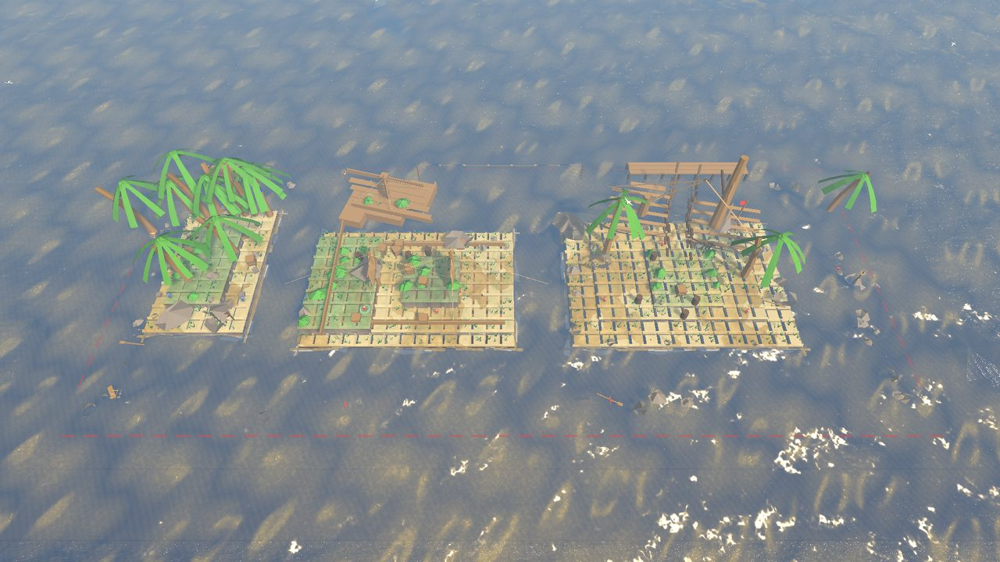
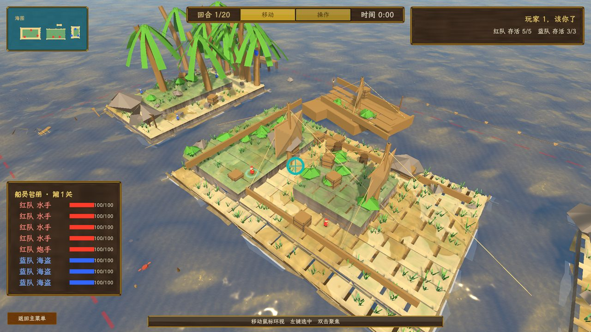
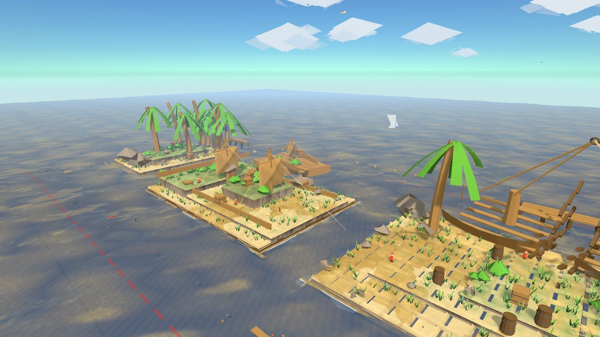
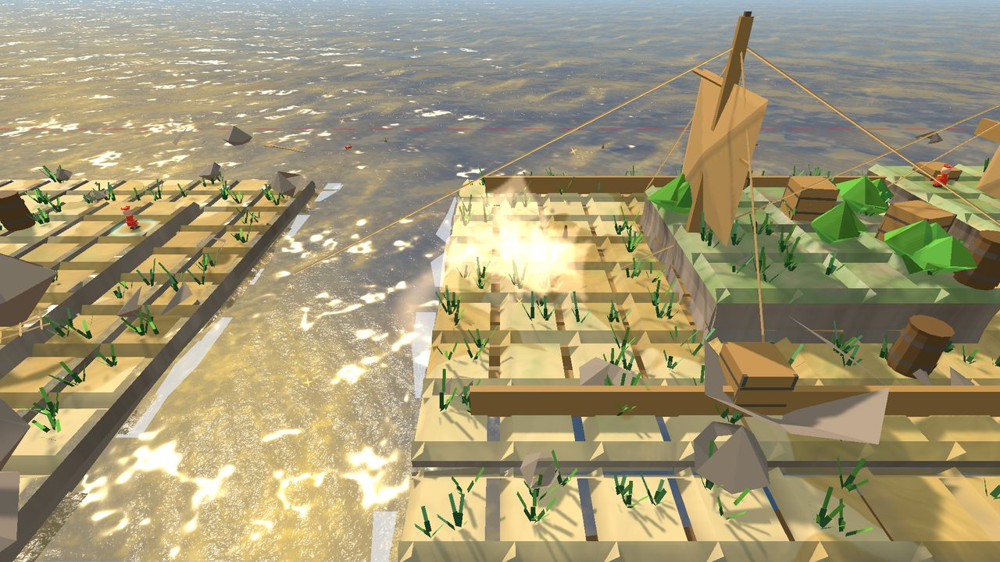
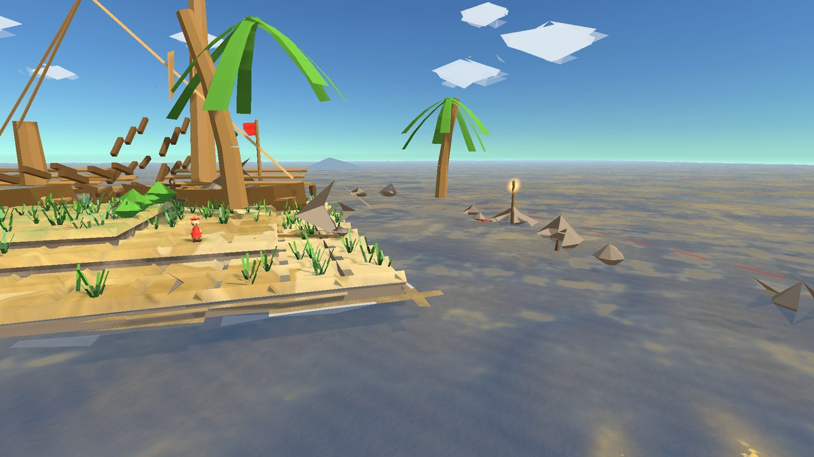
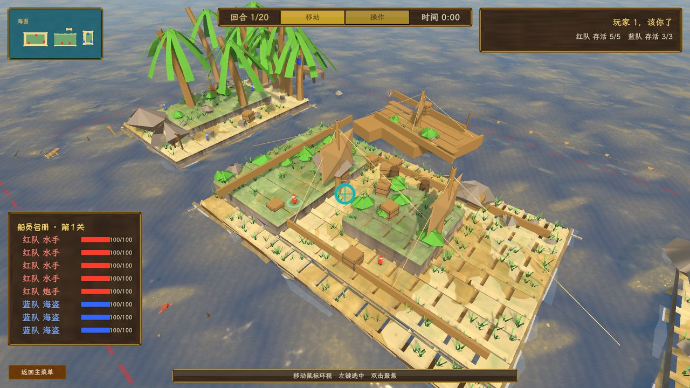

# 海盗军团夺宝 3D · Pirate Crew 3D

**把敌人的浮空岛轰进海里。**回合制弹弓投掷对战——拖拽瞄准、松手出膛、看抛物线划过阳光下的海面，然后一炮掀掉对手脚下的最后一块甲板。

> Unity 2022.3 写实 PBR 重制 · 向 Nitrome《Mutiny》（中译《海盗军团抢宝藏》）致敬的 3D 学习重制 · 求职作品集项目（非商业）
>
> **当前版本 v0.1** · 1P vs AI / 2P 同屏热座 · Windows

[](https://unity.com)
[](https://docs.unity3d.com/Packages/com.unity.render-pipelines.universal@14)
[](https://learn.microsoft.com/dotnet/csharp)
[](#质量工程)
[](#致谢)

---



## 关于这款游戏

你是红队海盗的船长。你和蓝队各占几座**悬在海面上空的浮空岛**，轮流用弹弓式的投掷武器互轰——直到把对面每一个船员都炸飞、烧着、或者干脆**轰下岛喂鲨鱼**。



### 🏝️ 站得越高，摔得越狠

竞技场不是平地，而是**悬空平台簇**：梯田岛、放样成型的三桅大帆船、空岛、小艇岛错落在海面上空。所有武器都会**逐格摧毁地形**——打不过敌人？把他站的那块甲板轰碎，让重力替你收人头。落水即死，没有游泳这个选项。



### 💣 17 种武器，17 种坏心眼

从保底的加农弹到需要点击引爆的香蕉，每一件都有自己的物理规则：

| | | |
|---|---|---|
| **加农弹** 撞到就爆 | **樱桃炸弹** 新手之友 | **炸药** 静止即引爆 |
| **巨石** 无爆碾压，速度越快伤害越高 | **地雷** 埋下去等下家 | **降落伞炸弹** 慢慢飘，慢慢瞄 |
| **朗姆酒瓶** 碎出一地扫射火焰 | **加农炮** 点击放炮位 | **香蕉** 弹性全表最高，点击引爆 |
| **八枚金币** 一个回合扔八次 | **船锚** 重击 | **海鸥** 派它去投弹 |
| **潮汐巨浪** 掀翻近水敌人 | **巫毒娃娃** 隔空钉人 | **扫射火焰** 火烧连营 |
| **木箱×3** 垒工事 | **火药桶×2** 会连锁殉爆 | |



### ⚓ 一整条海盗生涯

- **33 关战役**：原版 33 关地形 1:1 灵魂翻译——每一关的岛屿轮廓、高度、水距都源自原版 tile 地图，老玩家凭构图就认得出当年那关
- **船员管理**：港口招募海盗、编成出战小队、结算星级与经验
- **AI 对手**：按原版逆向工程的行为模型——自抛 50 次模拟落点、评估命中/落水/地形收益，还会记仇（evilness 加权）



### 🎯 投掷手感是真的

拖拽瞄准带**完整抛物线轨迹预览**，而且预览与实弹**逐步严格相等**——半隐式欧拉积分在引擎物理与预测代码里按同一时间步配平，所见即所得。右键环绕、滚轮缩放，45° 俯瞰全场或贴近行动角色特写随你切。



## 系统需求

| | 最低配置 | 推荐配置 |
|---|---|---|
| **操作系统** | Windows 10 64 位 | Windows 10/11 64 位 |
| **处理器** | 任意近五年 x64 双核 | 四核及以上 |
| **内存** | 4 GB | 8 GB |
| **显卡** | DirectX 11 兼容 | DirectX 11 兼容，2 GB 显存 |
| **存储** | 1 GB 可用空间 | 1 GB 可用空间 |

## 质量工程（写给招聘方）

这个仓库同时是一份**游戏客户端开发的工程作品集**——玩法之外，这些工程实践是本项目的另一半卖点：

- **数值三层架构**：纯 C# `WeaponCatalog`/`CrewCatalog`/`LevelCatalog` 是唯一真值来源（可无头测试）→ ScriptableObject 序列化投影 → Editor 幂等生成器产出资产。策划调参与编译期校验互不干扰，数值永不分叉。
- **997 条测试，6 秒跑完**：战斗数值/回合规则/AI 评估写成纯 C# 静态类，配套自研**无头验证台**（`dotnet` 直引 Unity 编译产物 + NUnit）——不启动 Unity 引擎即可编译全工程源码并跑纯逻辑测试，多 agent 并行开发时绕开 `Library/` 独占锁。另有 Unity Test Framework 的 EditMode/PlayMode 全量门禁。
- **预览 = 实弹**：投掷轨迹预测与 PhysX 弹道按 `1/25s` 固定步长逐步严格相等（半隐式欧拉配平），杜绝"瞄准线骗人"。
- **程序化美术管线（ArtGate）**：13 步一键烘焙——噪声贴图、材质、字体、音效、活物网格、场景装配、构建列表——任何机器可复现的资产不进版本库，从源头消灭"我这里不一样"。
- **视觉迭代闭环**：播放器自截图（8 机位）→ 程序化判据（洋红检测/对比度/WCAG/色相扫描）→ 修复 → 重拍，每一轮视觉迭代都有像素级验收档案（`export/art-review/`）。
- **模块化架构**：asmdef 编译期强制模块边界，跨模块通信只走登记在册的 EventBus 事件契约，禁止 `GameObject.Find` 与跨模块裸 `GetComponent`。
- **AI 辅助开发流程**：本仓库由人机协作完成——协调者 agent 亲自把关关键模块、并行 subagent 按互斥文件域分工、无头验证台内循环 + batchmode 外循环收口。全部决策与理由落档在 `docs/`（中文）。

## 运行

**玩（推荐）**：`external/build/PirateCrew3D.exe`（本地构建产物，不入库；从 [Releases](../../releases) 下载或按下节自建）。

**从源码跑**：用 Unity Hub 打开 `pirate-crew/` 子目录（**不是仓库根**），Unity 2022.3.62f1c1，打开后执行菜单 `PirateCrew → 管线 → 一键构建全部资产与场景`（可选，重建全部派生资产），然后 Play `Bootstrapper` 场景。

**从源码构建播放器**（`-buildWindows64Player` 为 Unity 原生命令行参数，按 Build Settings 场景列表出包）：

```bash
"F:/Unity/2022.3.62f1c1/Editor/Unity.exe" -batchmode -nographics -quit \
  -projectPath ./pirate-crew \
  -buildWindows64Player ./external/build/PirateCrew3D.exe -logFile -
```

## 目录速览

```
pirate-crew/Assets/
├── Scripts/
│   ├── Core/             # 引导器、EventBus、场景流转、存档
│   ├── PirateCrew/
│   │   ├── Data/         # 纯 C# 数值目录（真值来源）+ SO 定义
│   │   ├── Combat/       # 战斗纯逻辑：弹道/爆炸/回合/AI 评估
│   │   ├── Battle/       # 组装层：MonoBehaviour 薄壳 + 地形/场景美术
│   │   ├── SceneArt/     # 放样船体、岛壳几何、kit 构件、超美空岛
│   │   └── Rendering/    # 描边 RendererFeature（独立 asmdef）
│   ├── Campaign/ CrewManagement/ UI/ Audio/ Fx/ Visual/ Water/ Ambient/
├── Data/                 # 生成器产出的 SO 资产（48 个）
├── Editor/               # ArtGate、场景装配、资产生成器
├── Tests/                # NUnit：EditMode 按域分目录 + PlayMode
└── Scenes/ Prefabs/ Art/ Settings/
```

## 开发状态与路线图

- ✅ **v0.1（当前）**：回合制对战闭环、17/17 武器、可摧毁地形、33 关战役、船员招募/编成、AI 对手、2P 热座、写实 PBR 画面、音效
- 🔜 **v0.1.x**：视觉细节收口（超美空岛、岛形圆润化）、手感 juice（hit-stop/屏震/回合运镜）、音效变奏打磨
- 🗺️ **远期**：更多关卡机制、本地化（英文）、手柄支持

## 文档

| 要查什么 | 读哪个 |
| --- | --- |
| 项目状态与恢复入口 | [docs/交接与恢复指南.md](docs/交接与恢复指南.md) |
| 待办与归档 | [docs/待办事项.md](docs/待办事项.md) |
| 数值与玩法权威（原版逆向） | [docs/参考游戏逆向-海盗军团抢宝藏-静态.md](docs/参考游戏逆向-海盗军团抢宝藏-静态.md) |
| 3D 空间模型口径 | [docs/M2-3D空间模型对齐.md](docs/M2-3D空间模型对齐.md) |
| 跨模块事件契约 | [docs/EventBus事件契约.md](docs/EventBus事件契约.md) |
| 视觉迭代档案 | `export/art-review/*/诊断报告.md` |

## 致谢

- **Nitrome**——原版《Mutiny》的设计是本项目一切玩法规则的来源。本项目为个人学习性质的非商业重制，与 Nitrome 无关联；若版权方提出要求将立即下架。
- 玩法规则与数值依据自制的原版逆向文档（`docs/参考游戏逆向-*`），全部结论附可核对的出处行号。
