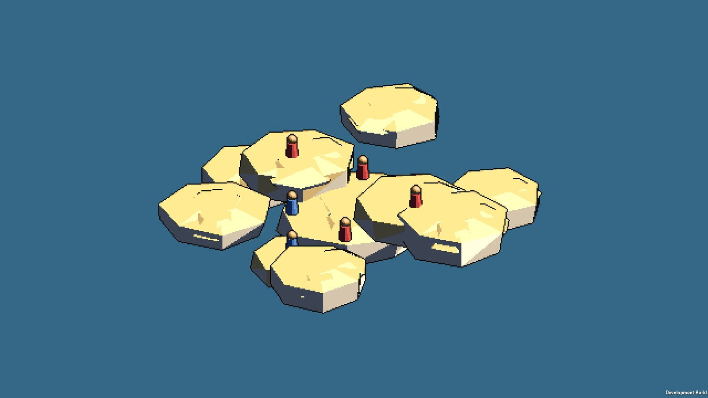
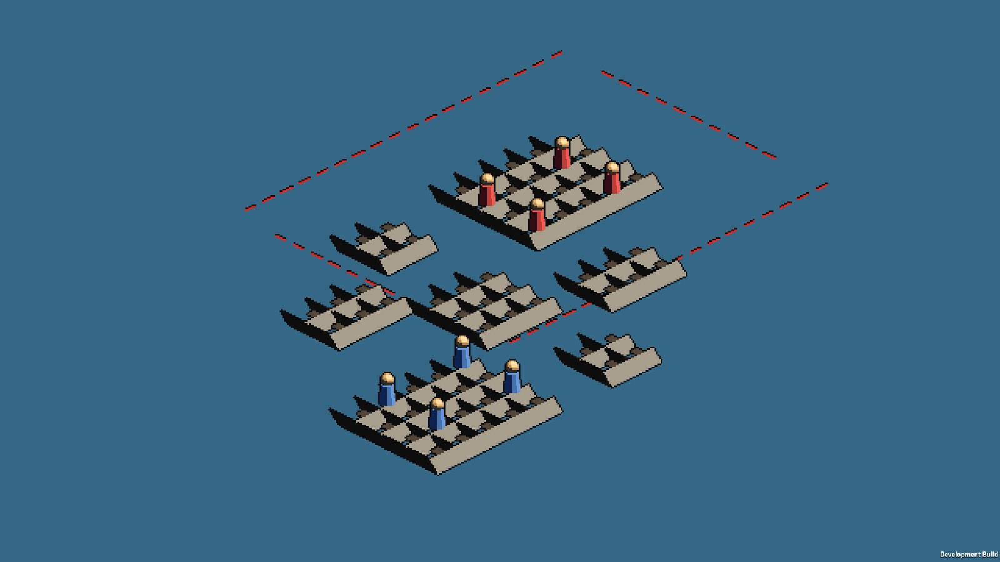
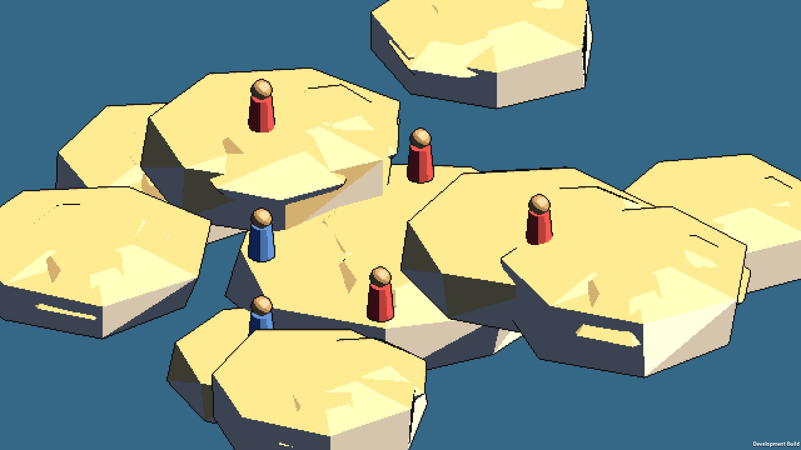

# 海盗军团夺宝 3D · Pirate Crew 3D

**把敌人的浮空岛轰进海里**。回合制投掷对战——环绕角色转视角、装填、开炮，看抛物线划过阳光下的云海，然后一炮把对手掀进天空的尽头。

> Unity 2022.3 写实 PBR 重制 · 向 Nitrome《Mutiny》（中译《海盗军团抢宝藏》）致敬的 3D 学习重制 · 求职作品集项目（非商业）
>
> **当前版本 v0.1** · [下载 Windows 版](https://github.com/fanboran/pirate-crew-3d-unity/releases/tag/v0.1.0) · 1P vs AI / 2P 同屏热座

[](https://unity.com)
[](https://docs.unity3d.com/Packages/com.unity.render-pipelines.universal@14)
[](#质量工程)
[](https://github.com/fanboran/pirate-crew-3d-unity/releases/tag/v0.1.0)

---


> 上图与本文各图是**像素化着色路径试点场景**（`-pixelartOut -pixelartLevel <N>`）的实拍——
> 这条路径正在试点、**尚未接进游戏本体**（本体仍是旧视觉链）。口径、读数与偏差项见
> [像素化路径 r9 归档](docs/images/pixelart-path/r9/README.md)。

## 三个关卡，三种心情

首发聚焦三个手作样板关——岛屿由放样曲线与低模几何直接生成，**没有任何方块拼接**。

### ☁️ 云端漫步

低模云朵平台场：11 朵云高低错落漂浮在海面上空，主角云可驻一整队。掉下云 = 落水，风力、距离、力度全靠一条实时抛物线预览。



### ⚓ 双雄并舷

两艘 28×14 单位的放样大帆船并列漂在航道两侧——15 站横剖面渐变船体、双桅、帆装、瞭望巢、索具，结构画全。中间一条水道，两边甲板对轰，把对方轰进海里。



> 注：本图是像素化路径下第 2 关**当前的内容**（碎岛礁盘，无船）；上文描述的「双雄并舷」双帆船
> 是已退役的程序化船体，船类资产待 Blender 管线重做（见 [待办](docs/项目/待办事项.md)）。
> 这张图本身也有一处已定位的缺陷（礁盘侧壁被描边整片涂黑），原因与修复方向见 [r9 归档](docs/images/pixelart-path/r9/README.md) §4。

### 🏝️ 天空之岛

这座岛有生活痕迹：草皮穹顶下藏着半塌的遗迹与悬浮主晶，崖边瀑布落向云海，西侧瞭望台飘着海盗旗。红蓝两队各据一头，岛缘之外就是天空。

## 炮台、跳跃与观察：三模式操作

不同模式左键语义不同（顶栏可点切换 / 快捷键 1·2·3）：

| 模式 | 玩法 |
|---|---|
| **1 移动** | 左键选角色；拖动 = 环绕角色转视角；A/D 转向、滚轮力度、空格跳跃 |
| **2 操作** | 纯炮台：A/D 转向、W/S 力度、滚轮微调、**回车开炮**（左键只点按钮，防走火） |
| **3 观察** | 我的世界同款：鼠标转视角、WASD 平移、Space/Shift 升降；点击准星选角色即返回 |



## 💣 17 种武器，17 种坏心眼

| | | |
|---|---|---|
| **加农弹** 撞到就爆 | **樱桃炸弹** 新手之友 | **炸药** 静止即引爆 |
| **巨石** 无爆碾压，速度越快伤害越高 | **地雷** 埋下去等下家 | **降落伞炸弹** 慢慢飘，慢慢瞄 |
| **朗姆酒瓶** 碎出一地扫射火焰 | **加农炮** 点击放炮位 | **香蕉** 弹性全表最高，点击引爆 |
| **八枚金币** 一个回合扔八次 | **船锚** 重击 | **海鸥** 派它去投弹 |
| **潮汐巨浪** 掀翻近水敌人 | **巫毒娃娃** 隔空钉人 | **扫射火焰** 火烧连营 |
| **木箱×3** 垒工事 | **火药桶×2** 会连锁殉爆 | |

## ⚓ 一整条海盗生涯

- **回合规则忠实原版**：每回合一名角色行动，先跳一次再攻击；开火即交回合；落水即死——全部逐条对齐原版反编译结论（见[逆向文档](docs/技术/参考逆向/参考游戏逆向-海盗军团抢宝藏-静态.md)）
- **AI 对手**：原版行为模型——自抛 50 次模拟落点、评估命中/落水/地形收益，还会记仇（evilness 加权）；也可切换 2P 同屏热座
- **海盗生涯循环**：港口招募 → 编成出战小队 → 选图出海 → 星级结算 → 存档（大海域 8 张海图全部可出战，招募按累计星数解锁）

## 🎯 预览 = 实弹

轨迹预览与真实弹道**逐步严格相等**——预测代码与 PhysX 按 1/25s 固定时间步做半隐式欧拉配平。所见弧线，即所飞弧线。

## 系统需求

| | 最低配置 | 推荐配置 |
|---|---|---|
| **操作系统** | Windows 10 64 位 | Windows 10/11 64 位 |
| **处理器** | 任意近五年 x64 双核 | 四核及以上 |
| **内存** | 4 GB | 8 GB |
| **显卡** | DirectX 11 兼容 | DirectX 11 兼容，2 GB 显存 |
| **存储** | 1 GB 可用空间 | 1 GB 可用空间 |

## 质量工程

这个仓库同时是一份**游戏客户端开发的工程作品集**——玩法之外，这些工程实践是本项目的另一半卖点：

- **1161 条测试全绿**（EditMode 用例数实测口径，另有 PlayMode 冒烟/接线用例）：战斗数值/回合规则/AI 评估写成纯 C# 静态类，配套自研**无头验证台**（`dotnet` 直引 Unity 编译产物 + NUnit）——不启动引擎即可编译全工程并跑纯逻辑测试（6 秒内），多 agent 并行开发时绕开 `Library/` 独占锁；需要 Unity 运行时的少量用例（存档 I/O 等）由 batchmode EditMode/PlayMode 门禁收口
- **数值三层架构**：纯 C# Catalog 是唯一真值来源（可无头测试）→ ScriptableObject 序列化投影 → Editor 幂等生成器，数值永不分叉
- **ArtGate 程序化烘焙管线**：13 步一键产出噪声贴图/材质/字体/音效/网格/场景，资产可复现、不入库
- **视觉迭代闭环**：播放器自截图（8 机位）→ 程序化像素判据（洋红/对比度/WCAG/色相扫描）→ 修复 → 重拍，每轮迭代有像素级验收档案
- **模块化架构**：asmdef 编译期强制模块边界，跨模块通信只走登记在册的 EventBus 事件契约
- **AI 辅助开发流程**：协调者 agent 把关关键模块、并行 subagent 按互斥文件域分工、无头内循环 + batchmode 外循环收口，决策全部落档 `docs/`

## 运行

**玩（推荐）**：从 [Releases](https://github.com/fanboran/pirate-crew-3d-unity/releases/tag/v0.1.0) 下载 `PirateCrew3D_v0.1.0_win64.zip`，解压双击 `PirateCrew3D.exe`。

**从源码跑**：Unity Hub 打开 `pirate-crew/` 子目录（**不是仓库根**），Unity 2022.3.62f1c1，菜单 `PirateCrew → 管线 → 一键构建全部资产与场景`（可选），Play `Bootstrapper` 场景。

**从源码构建播放器**（`-buildWindows64Player` 为 Unity 原生命令行参数）：

```bash
"F:/Unity/2022.3.62f1c1/Editor/Unity.exe" -batchmode -nographics -quit \
  -projectPath ./pirate-crew \
  -buildWindows64Player ./external/build/PirateCrew3D.exe -logFile -
```

## 目录速览

```
pirate-crew/Assets/
├── Scripts/
│   ├── Core/             # 引导器、EventBus、场景流转、存档
│   ├── PirateCrew/
│   │   ├── Data/         # 纯 C# 数值目录（真值来源）+ SO 定义
│   │   ├── Combat/       # 战斗纯逻辑：弹道/爆炸/回合/AI 评估
│   │   ├── Battle/       # 组装层：MonoBehaviour 薄壳 + 地形/场景装配
│   │   ├── SceneArt/     # 放样船体、低模云场、超美空岛（自由几何）
│   │   └── Rendering/    # 描边 RendererFeature（独立 asmdef）
│   ├── Campaign/ CrewManagement/ UI/ Audio/ Fx/ Visual/ Water/ Ambient/
├── Data/                 # 生成器产出的 SO 资产
├── Editor/               # ArtGate、场景装配、资产生成器
├── Tests/                # NUnit：EditMode 按域分目录 + PlayMode
└── Scenes/ Prefabs/ Art/ Settings/
```

## 开发状态与路线图

- ✅ **v0.1（当前）**：大海域 8 张世界海图（kit 岛 + 径向大海面）为唯一战斗内容、三个自由几何样板关（美术宣传层）、三模式操作、17/17 武器、回合制对战闭环、AI 对手、2P 热座、海盗生涯循环（招募/编成/出海/星级结算）、写实 PBR、音效
- 🔜 **v0.1.x**：手感 juice（hit-stop/屏震/运镜）、观察模式润色、海面视觉打磨
- 🗺️ **远期**：Blender 岛体管线批量扩容大海域、本地化（英文）、手柄支持

## 文档

| 要查什么 | 读哪个 |
| --- | --- |
| 项目状态与恢复入口 | [docs/项目/交接与恢复指南.md](docs/项目/交接与恢复指南.md) |
| 数值与玩法权威（原版逆向） | [docs/技术/参考逆向/参考游戏逆向-海盗军团抢宝藏-静态.md](docs/技术/参考逆向/参考游戏逆向-海盗军团抢宝藏-静态.md) |
| 3D 空间模型口径 | [docs/设计/M2-3D空间模型对齐.md](docs/设计/M2-3D空间模型对齐.md) |
| 跨模块事件契约 | [docs/技术/架构/EventBus事件契约.md](docs/技术/架构/EventBus事件契约.md) |
| 视觉迭代档案 | `docs/images/art-review/*/诊断报告.md` |

## 致谢

- **Nitrome**——原版《Mutiny》的设计是本项目一切玩法规则的来源。本项目为个人学习性质的非商业重制，与 Nitrome 无关联；若版权方提出要求将立即下架。
