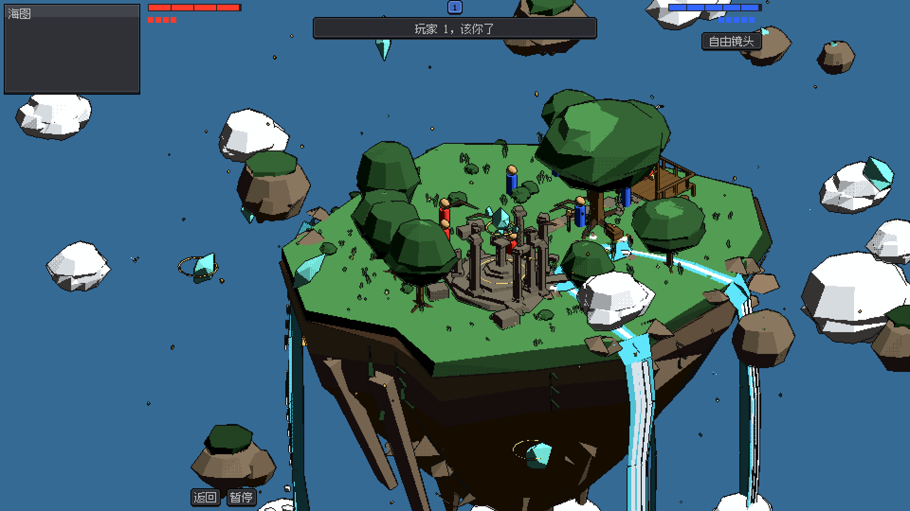
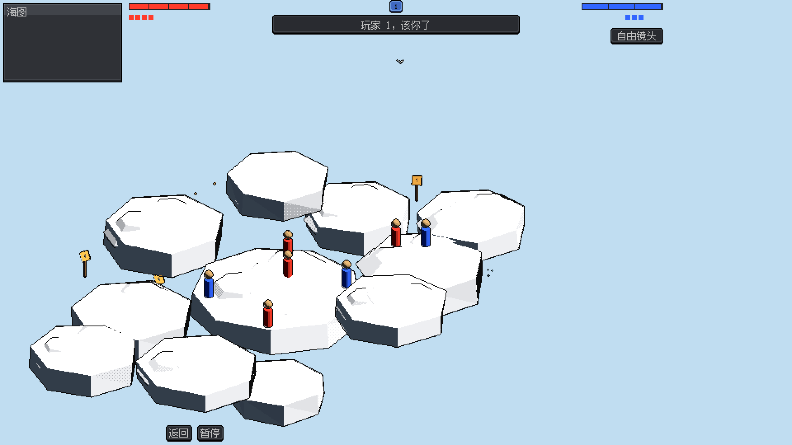
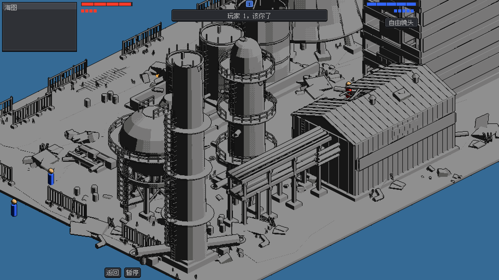
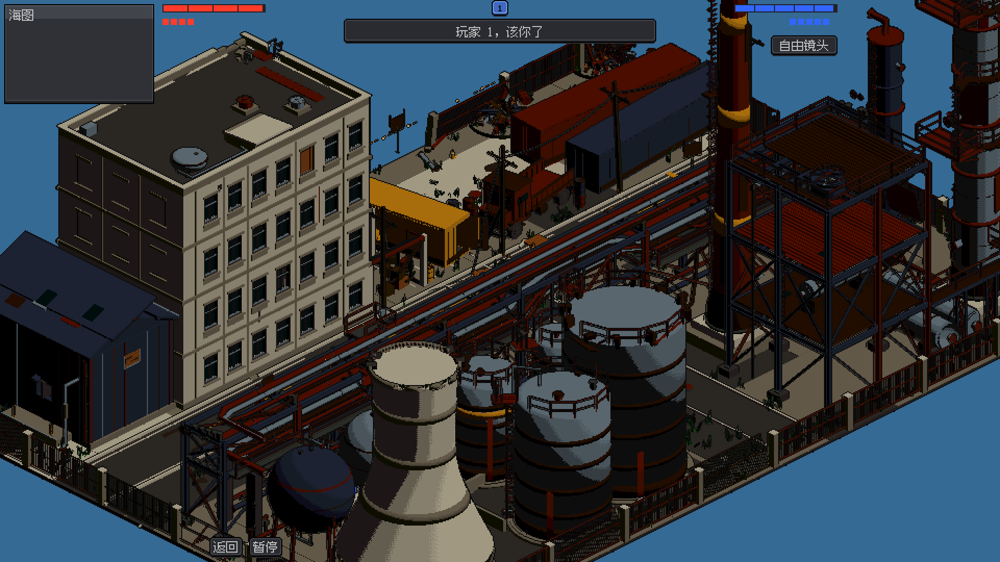
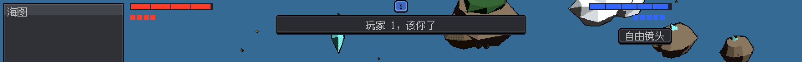
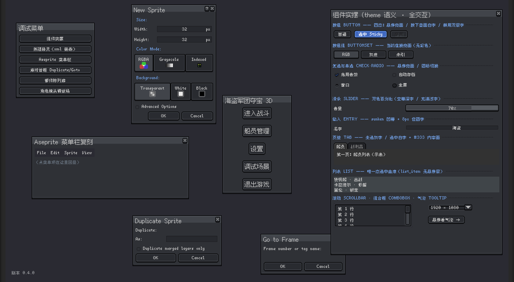
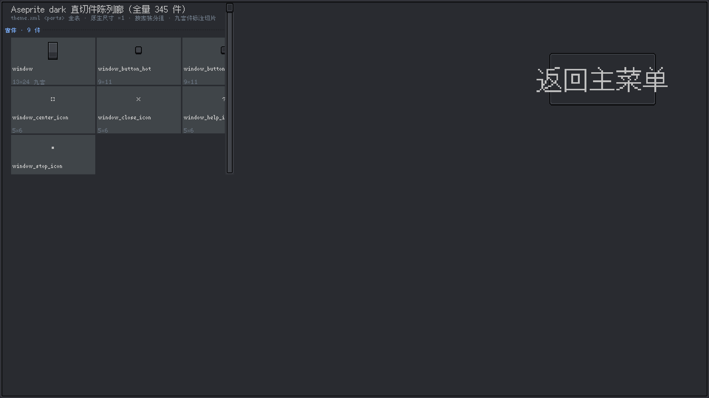

# 海盗军团夺宝 3D · Pirate Crew 3D



**把敌人的浮空岛轰进海里。** 回合制投掷对战——自由镜头飞行观战，点选你的船员，环绕、装填、开炮，看抛物线划过阳光下的云海，然后一炮把对手掀进天空的尽头。

> Unity 2022.3 · 等距像素卡通（自研像素化着色路径，唯一渲染路径）· 向 Nitrome《Mutiny》（中译《海盗军团抢宝藏》）致敬的 3D 学习重制 · 求职作品集项目（非商业）
>
> **[下载 Windows 版 Demo（Releases）](https://github.com/fanboran/pirate-crew-3d-unity/releases)** · 2P 同屏热座可玩 · 1P vs AI 重建中

[](https://unity.com)
[](https://docs.unity3d.com/Packages/com.unity.render-pipelines.universal@14)
[](docs/技术/渲染/管线/渲染管线.md)
[](https://github.com/fanboran/pirate-crew-3d-unity/releases/latest)

---

## 画面：等距像素卡通，而且是唯一的渲染路径

- **全场景统一像素化**：低分辨率渲染目标整数放大，3D 与 UI 同颗粒度——没有「3D 一套、界面一套」的混搭
- **每个物件都是像素物件**：自研 `PixelartObject` 着色路径，多档明暗 + 拜尔抖动 + 墨线描边 + 像素网格吸附（口径见[渲染管线文档](docs/技术/渲染/管线/渲染管线.md)）
- **角色是程序化低模船员**——定案风格，不许改的就是它；**场景资产走 Blender 无头管线建模入库**（`tools/blender/`，含应用图标）
- 观感不是调出来的，是**迭代验收**出来的：播放器自截图 → 程序化像素判据 → 修复 → 重拍，档案全部入库

## 战场：四张手作样板关

关卡由放样曲线、自由几何与 Blender 模型直接生成，**没有任何方块拼接**。

### ☁️ 云端漫步（关卡 1）

浅蓝海天上空，白色云台高低错落。主角云可驻一整队，掉下云 = 落水；风力、距离、力度全靠一条实时抛物线预览。



### 🏝️ 天空之岛（关卡 3）

程序化浮空岛：一颗种子稳定生成整座岛——草皮穹顶下藏着半塌的遗迹与悬浮主晶，崖边三挂瀑布坠向云海，西侧瞭望台飘着海盗旗，四周浮岩与萤光尘环绕。红蓝两队各据一头，岛缘之外就是天空。这座岛就是当前的正式战斗关，由八步装配链无头重烘入库（实拍即本页顶部大图）。

### 🏭 废弃化工厂（关卡 4/5）

Blender 无头管线手作建模的工业废墟两连关：精馏塔、管廊、储罐、冷却塔与四层旁楼，黄昏天光下打一场废墟攻防。两关各一张游戏内实拍：

| 关卡 4 · 手作总装 | 关卡 5 · 六件并行版 |
| --- | --- |
|  |  |

## 战斗：两态交互 + 米制投掷

| 状态 | 键位 |
| --- | --- |
| **自由镜头** | 按住右键转视角 / WASD 平移 / QE 升降；左键点选单位；Tab / 滚轮两档取景 |
| **选中·浏览** | 右键拖拽环绕；左键点其他己方单位换人（未行动时）；Tab / 滚轮两档取景 |
| **操作中** | A/D 方向角、W/S 仰角、Space/Shift 力度，回车或屏幕「发射」钮执行 |

- **回合规则忠实原版逆向结论**：每回合一名角色行动，先跳一次再攻击；开火即交回合；落水即死
- **弹道预览**：珠点弧线沿飞行路由大到小渐变，按与实弹同一组米制常量（单源 `StandardThrowRules`）积分到落点截断、不入地；落点环恒显、带指向箭头，被单位与地形正常遮挡
- **镜头语言**：位姿全目标化 + 指数平滑（唯一瞬切点是开局落位），近景/全景两档随关卡跨度，操作中锁定
- **武器系统重做中**：当前为「标准小炸弹」占位（HUD 武器面板与选择流保留）；v0.3.0 时代的 17 武器表是重做的概念底稿

## UI：以 Aseprite 参考库为唯一权威

观感与布局不照截图目测——控件语义出自 `theme.xml` 风格表，对话框走 `AseDialogLoader` 声明式装载，布局数字直接来自源库；像素纪律由代码控件库强制，不走 prefab 拼装。

- **组件体系**：面板七档色调 × 三态、凹槽（血条真实用法）、五色填充、语义件、页签、三态按钮，比例令牌逐件钉死
- **满精度像素字体四档**：正文位图栅格（12 的整数倍艺术像素），位图采样 + 图集 Point 过滤，杜绝亚像素糊边
- **战斗 HUD 墨盘化**：顶部回合提示盘 + 底部状态条，压世界层文字一律走按钮皮墨底盘，禁裸文字

*战斗 HUD 实拍顶部带（海图槽 / 红蓝分段血条 / 回合提示盘 / 自由镜头指示，自游戏内截图裁切）：*



*主菜单实拍（进入战斗 / 船员管理 / 设置 / 调试场景 / 退出游戏）：*



*UI 组件陈列廊实机窗口（theme.xml 全量 345 件直切件，原生尺寸陈列 + 九宫切片标注）：*



## ⚓ 一整条海盗生涯

港口招募 → 编成出战小队 → 选图出海 → 星级结算 → 存档。现役四张样板关，2P 同屏热座可玩；AI 对手随武器系统重做中（评估链已整拔重建）。

## 质量工程

这个仓库同时是一份**游戏客户端开发的工程作品集**——玩法之外，这些工程实践是本项目的另一半卖点：

- **纯 C# 核心 + 自研无头验证台**：战斗数值/回合规则刻意写成纯 C# 静态类，配套 harness（`dotnet` 直引 Unity 编译产物 + NUnit）——**不启动引擎**即可编译全工程并跑纯逻辑测试（秒级），多 agent 并行开发时绕开 `Library/` 独占锁
- **分级无头运行器 + 八步装配链**：战斗场景由一条命令无头重烘，场景折叠态（场景 = Prefab 实例）由 EditMode 契约测试冻结，改场景必跑接线转储比对
- **数值三层架构**：纯 C# Catalog 是唯一真值来源（可无头测试）→ ScriptableObject 序列化投影 → Editor 幂等生成器，数值永不分叉
- **视觉迭代闭环**：播放器自截图 → 程序化像素判据（洋红/对比度/色相扫描）→ 修复 → 重拍，每轮迭代有像素级验收档案（`docs/images/art-review/`）
- **模块化架构**：asmdef 编译期强制模块边界，跨模块通信只走登记在册的 EventBus 事件契约
- **AI 辅助开发流程**：协调者 agent 把关关键模块、并行 subagent 按互斥文件域分工、无头内循环 + batchmode 外循环收口，决策全部落档 `docs/`
- 测试结果以 Unity Test Runner 与 harness 实跑为准（EditMode / PlayMode / 纯逻辑域三档门禁）

## 系统需求

| | 最低配置 | 推荐配置 |
|---|---|---|
| **操作系统** | Windows 10 64 位 | Windows 10/11 64 位 |
| **处理器** | 任意近五年 x64 双核 | 四核及以上 |
| **内存** | 4 GB | 8 GB |
| **显卡** | DirectX 11 兼容 | DirectX 11 兼容，2 GB 显存 |
| **存储** | 1 GB 可用空间 | 1 GB 可用空间 |

## 运行

**玩（推荐）**：从 [Releases](https://github.com/fanboran/pirate-crew-3d-unity/releases) 下载 zip，解压双击 `PirateCrew3D.exe`。

**从源码跑**：Unity Hub 打开 `pirate-crew/` 子目录（**不是仓库根**），Unity 2022.3.62f1，Play `Bootstrapper` 场景。

**从源码构建播放器**（`-buildWindows64Player` 为 Unity 原生命令行参数）：

```bash
"F:/Unity/2022.3.62f1/Editor/Unity.exe" -batchmode -nographics -quit \
  -projectPath ./pirate-crew \
  -buildWindows64Player ./external/build/PirateCrew3D.exe -logFile -
```

## 目录速览

```
pirate-crew/Assets/
├── Scripts/
│   ├── Core/              # 引导器、EventBus、场景流转、存档
│   ├── PirateCrew/
│   │   ├── Data/          # 纯 C# 数值目录（真值来源）+ SO 定义
│   │   ├── Combat/        # 战斗纯逻辑：弹道/爆炸/回合规则
│   │   ├── Battle/        # 组装层：MonoBehaviour 薄壳 + 相机/交互/场景装配
│   │   ├── SceneArt/      # 自由几何样板关（放样/低模云场）
│   │   ├── SceneArtBake/  # 程序化浮岛合成与烘焙（种子稳定复现）
│   │   └── Rendering/     # 像素化着色路径（独立 asmdef）
│   ├── Campaign/ CrewManagement/ UI/
├── Pixelart/              # 像素舞台试点（调试关装配）
├── Art/                   # Aseprite UI 参考库、字体、材质、Blender FBX
├── Editor/                # 八步装配链、ArtGate、资产生成器、截图器
├── Tests/                 # NUnit：EditMode 按域分目录 + PlayMode
└── Scenes/ Prefabs/ Resources/ Settings/
```

## 开发状态与路线图

- 🚧 **进行中**：武器系统重做（现为标准炸弹占位）、AI 对手重建、两态交互手感数值定案（实机走查）、像素化路径余项（调色板定档 / 资产翻新 / 暗部色与线宽裁决）
- ✅ **v0.4.0（当前发行）**：等距像素卡通确立为唯一渲染路径（全场景 + UI 同颗粒度）；天空之岛程序化浮岛接进正式战斗关；战斗 HUD 墨盘化；两态交互 + 投掷米制重立；废弃化工厂两关入库；UI 按 Aseprite 参考库全量复刻
- ✅ **v0.3.0（上一发行）**：17 武器、AI 对手、8 张大海域海图、写实 PBR 时代——海图已整删、AI 已随武器重做退役，17 武器表留作概念底稿
- 🔜 **下一步**：手感 juice（hit-stop/屏震/运镜）、海图重做、武器逐值定案
- 🗺️ **远期**：Blender 场景管线批量扩容关卡、本地化（英文）、手柄支持

## 文档

| 要查什么 | 读哪个 |
| --- | --- |
| 项目状态与恢复入口 | [docs/项目/交接与恢复指南.md](docs/项目/交接与恢复指南.md) |
| 渲染管线口径 | [docs/技术/渲染/管线/渲染管线.md](docs/技术/渲染/管线/渲染管线.md) |
| 交互与操作规格 | [docs/技术/交互操作契约.md](docs/技术/交互操作契约.md)（设计层见 [docs/设计/操作与交互.md](docs/设计/操作与交互.md)） |
| 跨模块事件契约 | [docs/技术/架构/EventBus事件契约.md](docs/技术/架构/EventBus事件契约.md) |
| 玩法数值历史参考（原版逆向·已归档） | [docs/项目/归档/参考逆向/参考游戏逆向-海盗军团抢宝藏-静态.md](docs/项目/归档/参考逆向/参考游戏逆向-海盗军团抢宝藏-静态.md) |
| 视觉迭代档案 | `docs/images/art-review/*/诊断报告.md` |

## 致谢

- **Nitrome**——原版《Mutiny》的设计是本项目一切玩法规则的来源。本项目为个人学习性质的非商业重制，与 Nitrome 无关联；若版权方提出要求将立即下架。
