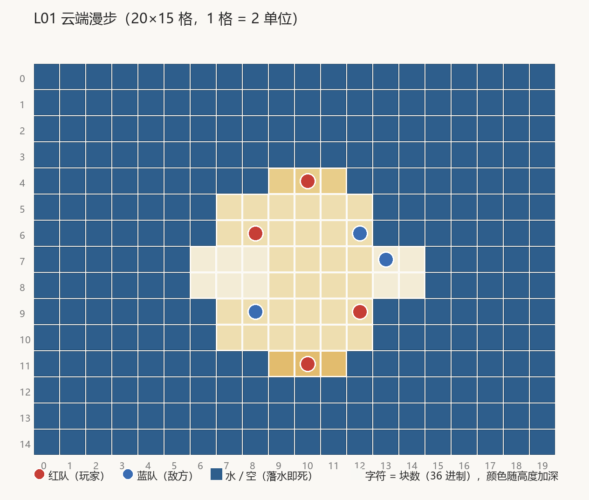

# 01-云端漫步

> 地形布局由用户设计。**编成(人数/摆位/武器/luck)与数值尚未设计**——关卡数据里的现值为占位,仅保证可玩。

## 布局(场地 40×30 m,ASCII 图每格示意 2 m)



```layout L01 云端漫步 palette=cloud
........gggg........
........gggg........
.....dddgggg555.....
.eeeeddd....555cccc.
.eeee9999999555cccc.
.eeee99999999..cccc.
.eeee99999999..cccc.
.....99999999.......
.....99999999.......
.666699999999..5555.
.666699999999555555.
.666699999999555555.
.....fffaaaa........
........aaaa........
........aaaa........
```

字符 = 块数(36 进制):`9`=y4.5 主角云,`5`=y2.5 低位云,`d`=y6.5 西南中继,`f`=y7.5 西北制高点,
`6`=y3、`a`=y5、`c`=y6、`e`=y7、`g`=y8 为第二环各朵,`.`=空(坠落到海面即死)。

| 分区 | 区间 (m) | 顶面高度 | 地形角色 |
| --- | --- | --- | --- |
| 主角云 | 场心 (20,15) | y4.5 | 主战场 |
| 西北云 | (12.6,22.4) | y7.5(15 块) | 制高点(红蓝队长驻) |
| 西南云 | (12.6,7.6) | y6.5(13 块) | 中继台 |
| 东北 / 东南云 | (27.4,22.4) / (27.4,7.6) | y2.5 | 低位台 |
| 第二环 6 朵 | 椭圆分布(x 半径 16 / z 半径 11.5、方位 30°+60°×n) | y2.5/3/5/6/7/8 各一 | 外环跳板 |

【散开布局】(2026-10-07 创始人裁决"云朵均匀分布、散开、尽量不相互遮挡")：环1 从正方位
转到 45° 斜方位且半径 6.5→10.5(旧布局环1 嵌进主角云 3.5m),环2 椭圆向东西散开。45° 机位
视线朝 +x+z,**视线走廊侧(东北/东南)一律低位 2.5**,制高点在西北(视线侧后方,永不盖人)。
可站轮廓为贴合云台的 16 边形/方形,图中方块为近似示意;布局参数真源在
tools/blender/scene/islands/translate_cloudfield.py 的 layout()。

## 资产

| 资产 | 状态 | 管线归属 |
| --- | --- | --- |
| CloudWalk.fbx(11 朵环形 blob 云田,C# 几何的 Blender 忠实翻译) | 现有 | tools/blender/scene/islands/translate_cloudfield.py |
| ShowcaseDangerBorder.prefab | 现有 | 同上 |
| OceanRig 海面 + 氛围 | 现有 | 运行时系统 |

## 验收(地形)

| # | 判据 | 核对方式 |
| --- | --- | --- |
| 1 | 全部出生点落在实心地块上 | EditMode 站位实心测试 |
| 2 | 云间最大空距 ≤6 m | EditMode 布局度量测试 |
| 3 | 实拍:云场构图同源、无缺件无洋红、单位站云面不悬空 | 播放器 `-artReviewLevel 1` 出图走查 |
