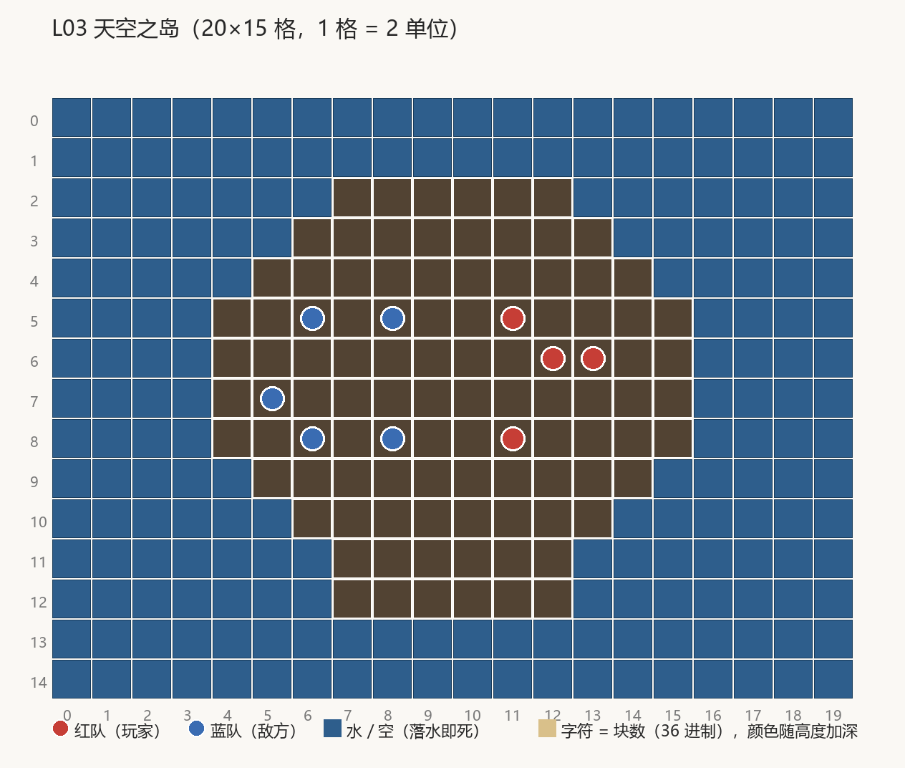

# 02-天空之岛

> 地形布局由用户设计。**编成(人数/摆位/武器/luck)与数值尚未设计**——关卡数据里的现值为占位,仅保证可玩。

## 布局(场地 40×30 m,ASCII 图每格示意 2 m)



```layout L03 天空之岛 palette=island
....................
....................
.......ssssss.......
......ssssssss......
.....ssssssssss.....
....ssssssssssss....
....ssssssssssss....
....ssssssssssss....
....ssssssssssss....
.....ssssssssss.....
......ssssssss......
.......ssssss.......
.......ssssss.......
....................
....................
```

字符 `s` = 28 块(顶面 y=14 m,与场景空岛草皮面对齐),`.` = 空(坠海即死)。

| 分区 | 区间 (m) | 地形角色 |
| --- | --- | --- |
| 岛心 | x 16-22 m / z 10-18 m | 离边缘最远,枪线四通 |
| 东半 | x 22-30 m / z 8-18 m | 东侧,背靠岛缘 |
| 西半 | x 8-16 m / z 8-18 m | 西侧 |
| 中央带 | x 18-20 m | 场心中轴 |

## 资产

| 资产 | 状态 | 管线归属 |
| --- | --- | --- |
| SkyIsland.fbx(大岛 + 浮空岛群,Blender 岛形驱动) | 现有 | tools/blender/scene/islands/ |
| ShowcaseDangerBorder.prefab | 现有 | 同上 |
| OceanRig 海面 + 氛围 | 现有 | 运行时系统 |

## 验收(地形)

| # | 判据 | 核对方式 |
| --- | --- | --- |
| 1 | 全部出生点落在实心地块上 | EditMode 站位实心测试 |
| 2 | 岛面高度恒 28 块(y=14 m,与空岛草皮面偏差 ≤±0.02 口径同源) | EditMode 布局度量测试 |
| 3 | 实拍:大岛 + 漂浮空岛群同源、无缺件无洋红 | 播放器 `-artReviewLevel 3` 出图走查 |
