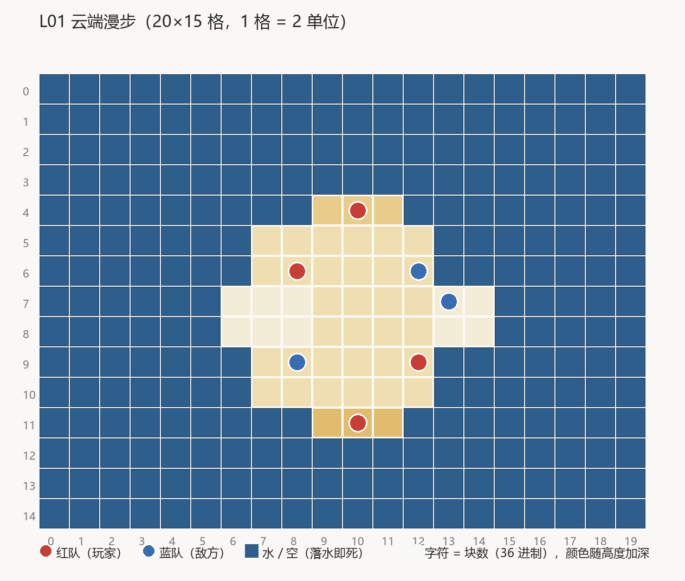

# L01 云端漫步（关卡设计文档）

> **状态：AI 提案/待定**（按 [关卡制作管线](关卡制作管线.md) 阶段 1-2 产出，待用户走查）。
> 数值锚点引用见文末出处表。

## 1. 概念卡

- **一句话**：悬浮云海之上的第一场夺宝战——学会扔、学会轮到谁、学会怕坠落。
- **体验目标**：30 秒内打出第一发投掷（GDD §12 引导目标，`../game-3/docs/gdd.md:1023-1081`）；
  三分钟内尝到一次"把敌人轰下云"的核心爽感。
- **教学目标**：① 拖拽-投掷手感；② 回合流转（每回合 1 个角色行动）；③ 云台边缘 = 死亡区。
  不教武器多样性（原版首关只有 cherryBomb + dynamite 两种，`关卡设计语言:308-322`）。
- **记忆点**：踩在落差 5 单位的高低云之间打第一仗。
- **母题与对称**：单一大平台 + 环绕小台，原版 L1「三簇三线」的 3D 意译；面积公平、形状不等
  （原版 L1 IoU 0.37 但双方平台面积对等，`关卡设计语言:230-232`；R7）。
- **美术方向**：低模云场（已过审的 CloudField.prefab，保留）。

## 2. 关内节奏

```
强度
 ▲                    ╭─╮ 船长对轰（红蓝船长各守一云）
 │      ╭──╮         ╱   ╲
 │     ╱    ╲___╯     ╲___╱ 收尾清场（残血逃向环云）
 │  ╭─╯  开局安全对射（跨云 3-5 格，掷歪落空不致命）
 └──┴──────────────────────────▶ 回合
```

开局双方主力都在主角云上对峙，距离近但互相掷不准（教学期的宽容度来自蓝方 luck=1）；
中期红方主动出击环云上的蓝方；收尾是高度差追击。

## 3. 布局（20×15 格，1 格 = 2 单位，块高 0.5）



```layout L01 云端漫步 palette=cloud
....................
....................
....................
....................
.........ddd........
.......999999.......
.......999999.......
......555999955.....
......555999955.....
.......999999.......
.......999999.......
.........fff........
....................
....................
....................
spawns: R(8,6)(12,9)(10,11)(10,4) B(12,6)(8,9)(13,7)
```

字符 = 块数（36 进制）：`5`=y2.5 西/东云，`9`=y4.5 主角云，`d`=y6.5 南云，`f`=y7.5 北云，
`.`=空（坠落到海面即死）。

| 分区 | 格区间 | 顶面高度 | 战术角色 |
| --- | --- | --- | --- |
| 主角云 | 7-12 × 5-10 | y4.5（9 块） | 主战场，双方 5 个单位在此对峙 |
| 北云 | 9-11 × 11 | y7.5（15 块） | 制高点，红船长位 |
| 南云 | 9-11 × 4 | y6.5（13 块） | 中继台 |
| 西云 / 东云 | 6-8 × 7-8 / 13-14 × 7-8 | y2.5（5 块） | 低位诱饵台，蓝方占位 |

**尺度实算与 R 规则对表**：

| 度量 | 实算 | 对照 |
| --- | --- | --- |
| 平台格数 | 主角云 32 + 环云 17 ≈ 49 格 / 7 人 ≈ 7 格每人 | R2 ≥4 ✓ |
| 云间最大空距 | 3 格（易跨档，R16 常规 ≤5 ✓） | R3 ✓ |
| 高度档数 | 4 档（2.5/4.5/6.5/7.5） | **有意偏离 R18**（原版首关 ≤2 层）：云场美术方向要求高低错落（用户 2026-09-14 裁决），教学压力改由 4v3 编成 + 蓝方 luck=1 补偿 |
| 主平台包络 | 6×6 格 | R1 意译（原版 ≥8×4；20×15 场地内成立） |

## 4. 编成与数值

红队 = 玩家（4 人，luck 5=默认）；蓝队 = 敌方（3 人，**luck 1**，本关难度旋钮）。
单位属性全员相同（HP100，原版无属性差，`静态:306-320`）——难度只来自数量与 luck。

| 单位 | 队 | 格位 | luck | 初始武器 |
| --- | --- | --- | --- | --- |
| redPirate | 红 | (8,6) | 5 | cherryBomb×10 |
| redPirate | 红 | (12,9) | 5 | cherryBomb×10 |
| redPirate | 红 | (10,4) | 5 | cherryBomb×10 |
| redPirateCaptain | 红 | (10,11) | 5 | cherryBomb×10 |
| cabinBoy | 蓝 | (12,6) | 1 | cherryBomb×10 |
| cabinBoy | 蓝 | (8,9) | 1 | cherryBomb×10 |
| cabinBoyCaptain | 蓝 | (13,7) | 1 | cherryBomb×10 |

## 5. 武器与掉落

- **初始**：全员 cherryBomb×10（原版 L1 同款，`关卡设计语言:119` 行 L1 条目）。
- **空投池**：Dynamite×10（原版 L1 空投 = dynamite∞，同上）——第二回合起玩家有机会捡到
  大当量武器，完成"武器原来还有别的"的第一次惊喜，但不提前泄洪。
- 旧版船长带 banana、空投带 ParachuteBomb 的配置**移除**（教学期不引入引爆时机/操控
  类机制，见 §1 教学目标）。

## 6. 难度定位

关间曲线最左端（见 [README](README.md)）：蓝方 3 人 / luck 1 / 1 种武器 / 1 种空投，
全部取曲线最小值。

## 7. 资产清单

| 资产 | 状态 | 管线归属 |
| --- | --- | --- |
| CloudField.prefab | 现有（已过审） | 岛壳/云场烘焙（SceneArtBaker） |
| ShowcaseDangerBorder.prefab | 现有 | 同上 |
| OceanRig 海面 + 氛围 | 现有 | 运行时系统 |

无待产资产。

## 8. 验收标准

| # | 判据 | 核对方式 |
| --- | --- | --- |
| 1 | 7 个出生点全部落在实心格上 | EditMode 站位实心测试（全部样板关共用用例） |
| 2 | 编成 = 红 4 / 蓝 3；全员初始武器仅 cherryBomb | EditMode 编成测试（BattlePlanTests） |
| 3 | 空投池 = {Dynamite} | 同上 |
| 4 | 云间最大空距 ≤3 格 | EditMode 布局度量测试 |
| 5 | 实拍：云场构图与上一版同源、无缺件无洋红、单位站云面不悬空 | 播放器 `-artReviewLevel 1` 出图走查 |

### 走查记录（阶段 4，2026-09-19，AI 自查待用户终审）

判据 1-4 由 EditMode `ShowcaseLevelDesignTests` / `BattlePlanTests` 钉死（1163 绿）。判据 5 实拍
[arena-overview](../../images/level-design/L01-实拍-arena-overview.jpg)：主角云 + 四环云齐、
7 人贴云面无悬空、无船、无洋红、海面正常——通过。
