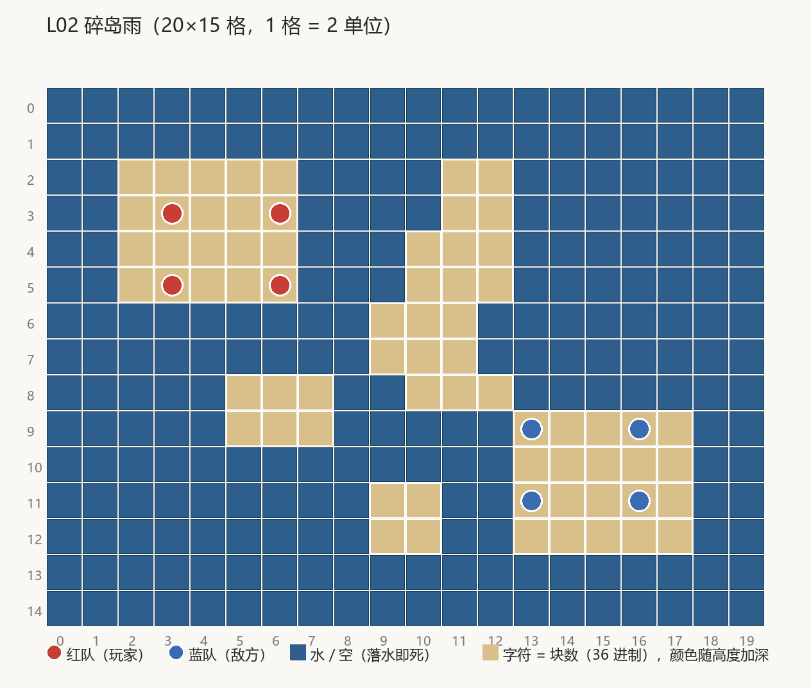

# L02 碎岛雨（关卡设计文档）

> **状态：AI 提案/待定**（按 [关卡制作管线](关卡制作管线.md) 阶段 1-2 产出，待用户走查）。
> 本关整体替换退役的「双雄并舷」（归档见
> [关卡归档-样板三关DEMO-v0.1.md](关卡归档-样板三关DEMO-v0.1.md)）。

## 1. 概念卡

- **一句话**：海面上一片低矮礁岛群——每一次投掷都要掂量落点，掷不准就是喂鱼。
- **体验目标**：第一次真正怕水（原版水危险度渐进：L1 窄沟 → L2 首次真落水威胁，
  `关卡设计语言:257-258`）；打出第一次"预判敌人走位、把炸弹垫在跳板上"的阵地博弈。
- **教学目标**：① 落水即死的风险管控（边缘站位代价）；② 跨岛投掷的抛物线精度；
  ③ positional 武器初体验（mine 封锁跳板 / gunpowderBarrel 连锁）。
- **记忆点**：满场碎岛 + 空投箱落在谁都够不着的小岛上。
- **母题与对称**：碎岛雨（原版 L2，19 碎块全悬空平台，`关卡设计语言:204-217` 母题④）；
  **中心对称**（180° 旋转）——双方面积与到中枢距离严格相等，比的是执行（R7 的公平变体）。
- **美术方向**：低矮礁岛岛壳（IslandShellGeometry 烘焙，与 L3 空岛岩石材质同族）。

## 2. 关内节奏

```
强度
 ▲              ╭──╮ 中枢绞肉（C1 是全场十字路口，谁占谁吃枪线）
 │        ╭────╯    ╲
 │       ╱ 抢跳板（mine 垫在 1-2 格水隙上，封锁对面上岛路线）
 │  ╭───╯               ╰──╮ 水边残局（把残血敌人往边缘逼）
 └──┴───────────────────────▶ 回合
```

开局双方各据主岛对射试探（跨群 5-6 格，需要中继岛接驳）；中期争夺中央枢纽 C1；
残局在水线边缘的心理战——一步之遥就是海。

## 3. 布局（20×15 格，1 格 = 2 单位，块高 0.5）



```layout L02 碎岛雨 palette=island
....................
....................
..11111....11.......
..11111....11.......
..11111...111.......
..11111...111.......
.........111........
.........111........
.....111..111.......
.....111.....11111..
.............11111..
.........11..11111..
.........11..11111..
....................
....................
spawns: R(3,3)(6,3)(3,5)(6,5) B(16,11)(13,11)(16,9)(13,9)
```

字符 `1` = 1 块（顶面 y0.5 的低礁岛，全部同高——原版 L2 全场 1 层，`关卡设计语言:120`），
`.` = 海面（落水即死）。

| 分区 | 格区间 | 战术角色 |
| --- | --- | --- |
| 红方主岛 | 2-6 × 2-5（5×4） | 红方出生地，背靠西北角 |
| 蓝方主岛 | 13-17 × 9-12（5×4） | 蓝方出生地，与红岛中心对称 |
| C1 中枢 | 9-11 × 6-8（3×3） | 全场十字路口，南北两跳板的汇点 |
| C2 / C3 侧岛 | 5-7 × 8-9 / 12-14 × 4-5（3×2） | 西南/东北侧翼，对中枢形成交叉枪线 |
| C4 / C5 哨岛 | 9-10 × 2-3 / 9-10 × 11-12（2×2） | 前哨，最靠近敌方主岛的跳板 |

**尺度实算与 R 规则对表**：

| 度量 | 实算 | 对照 |
| --- | --- | --- |
| 岛群格数 | 20+20+9+6+6+4+4 = 69 格 / 8 人 ≈ 8.6 格每人 | R2 ≥4 ✓ |
| 岛间水隙 | 邻岛多为 1-2 格；最大 5 格（红主岛↔C3 的"东北快线"大跨） | R3 常规 1-5 ✓（落水威胁来自碎岛密度而非距离——原版 L2 同理） |
| 簇数 | 7 个独立岛 | R9 教学-常规带 5-9 ✓ |
| 母题 | 单一碎岛母题，无拼盘 | R6 ✓ |
| 对称 | 中心对称（红岛↔蓝岛、C2↔C3、C4↔C5 皆 180° 对） | R7 公平变体 ✓ |
| 单次跨越 | ≤2 格 ≤ 满力射程 11.75 格的 17% | R16 ✓ |

**路线读法**：红→C4（2 格）→C3（1 格）→蓝（角邻）是东北快线；红→C2（2 格）→C1（1 格）
→C5（2 格）→蓝（2 格）是中央稳妥线；直接红→C3 跨 5 格是高风险大跨（满力 43%）。

## 4. 编成与数值

红队 = 玩家（4 人，luck 5）；蓝队 = 敌方（4 人，**luck 2**——比 L1 聪明一档，
AI 试投次数翻倍）。

| 单位 | 队 | 格位 | luck | 初始武器 |
| --- | --- | --- | --- | --- |
| redPirate | 红 | (3,3) | 5 | cannonball×10 |
| redPirate | 红 | (6,3) | 5 | cannonball×10 |
| redPirate | 红 | (3,5) | 5 | cannonball×10 |
| redPirateCaptain | 红 | (6,5) | 5 | cannonball×10 + gunpowderBarrel×2 |
| cabinBoy | 蓝 | (16,11) | 2 | cannonball×10 |
| cabinBoy | 蓝 | (13,11) | 2 | cannonball×10 |
| cabinBoy | 蓝 | (16,9) | 2 | cannonball×10 |
| cabinBoyCaptain | 蓝 | (13,9) | 2 | cannonball×10 + gunpowderBarrel×2 |

## 5. 武器与掉落

- **初始**：全员 cannonball×10（保底弹），双方船长带 gunpowderBarrel×2——可放置、可连锁，
  是"用武器改造地形"的第一课（原版 gunpowderBarrel 首现于 L2，`关卡设计语言:313`）。
- **空投池**：Mine + RumBottle + Banana（原版 L2 首现 anchor/parachuteBomb/rumBottle/
  gunpowderBarrel/woodenCrate 五件，`关卡设计语言:313`——本关意译取三件最贴碎岛母题的：
  mine 封锁跳板、rumBottle 落地产火隔断水道、banana 手动引爆练时机）。

## 6. 难度定位

曲线中段（见 [README](README.md)）：蓝方 4 人 / luck 2 / 2 种初始武器 / 3 种空投——
数量追平、AI 变聪明、武器池开闸。

## 7. 资产清单

| 资产 | 状态 | 管线归属 |
| --- | --- | --- |
| Islets_L02.prefab（岛壳碎岛群） | **本轮新增**（烘焙） | 岛壳烘焙（SceneArtBaker：IslandShellGeometry.BuildSolidShell + L3 空岛岩石材质族） |
| ShowcaseDangerBorder.prefab | 现有 | 岛壳/云场烘焙 |
| OceanRig 海面 + 氛围 | 现有 | 运行时系统 |
| （升级候选）FloatingIslandComposer 小尺寸多岛版 | 提案/待定 | 观感升级时替换岛壳碎岛（需用户样板过目） |

## 8. 验收标准

| # | 判据 | 核对方式 |
| --- | --- | --- |
| 1 | 8 个出生点全部落在实心格上 | EditMode 站位实心测试 |
| 2 | 编成 = 红 4 / 蓝 4，蓝方 luck 全 2 | EditMode 编成测试 |
| 3 | 独立岛数 = 7；岛间最大水隙 ≤2 格 | EditMode 布局度量测试（4 连通域计数） |
| 4 | 摆位契约：Islets_L02 恒摆原点（岛壳与逻辑场按构造对齐） | EditMode 摆位测试 |
| 5 | 实拍：岛群顶面与单位脚底齐平（无悬空/陷岛）、水线以下无空洞、无缺件无洋红 | 播放器 `-artReviewLevel 2` 出图走查 |

### 走查记录（阶段 4，2026-09-19，AI 自查待用户终审）

判据 1-4 由 EditMode `ShowcaseLevelDesignTests` / `SceneArtBakeDeterminismTests` 钉死（1163 绿，
含 7 簇 / 69 格 / 最大水隙 5 / 摆位恒原点 / 重烘逐字节零漂移）。判据 5 实拍
[arena-overview](../../images/level-design/L02-实拍-arena-overview.jpg) /
[battle-45](../../images/level-design/L02-实拍-battle-45.jpg)：7 座岛对角布局、
8 人脚底贴岛面、无船、无洋红、海面正常——通过（俯瞰机位下红蓝呈对角镜像，属相机朝向，
站位坐标已由测试钉死）。
