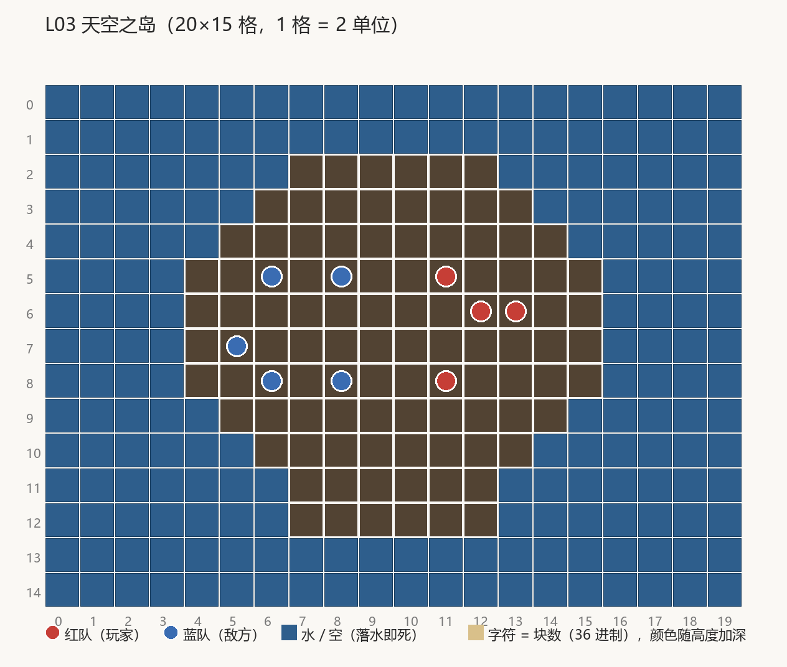

# L03 天空之岛（关卡设计文档）

> **状态：AI 提案/待定**（按 [关卡制作管线](关卡制作管线.md) 阶段 1-2 产出，待用户走查）。

## 1. 概念卡

- **一句话**：高山大岛上的终章试炼——以四敌五，被围攻时用地形与武器池翻盘。
- **体验目标**：终局感与翻盘爽（原版以少打多的 L12：5v11 掩体最密关，`关卡设计语言:290`）；
  高空抛物线的掌握度考核（满力、顺风、边缘下压）。
- **教学目标**：① 综合运用前两关全部技能；② 越水/控场武器的价值（空投池开闸）；
  ③ 以少打多时的目标选择（先集火谁）。
- **记忆点**：站在 y14 的高山岛边缘，身后是浮空岛群与云海。
- **母题与对称**：单一大岛同场混战（原版 L7/L15 Boss 关母题⑧，`关卡设计语言:204-217`）；
  **强镜像**（东西分居，结构对称、出生微差，R7 的 0.70-0.90 档）。
- **美术方向**：山包大岛 + 超美空岛（已过审的场景静态空岛，保留）。

## 2. 关内节奏

```
强度
 ▲    ╭──────────────╮ 中场岛心绞肉（双方兵力在此消耗殆尽）
 │   ╱                ╲
 │  ╱ 东西对峙（隔 5 格中央带互掷，比谁的抛物线压得低）
 │ ╱                              ╰─╮ 残局边缘心理战
 └┴───────────────────────────────────▶ 回合
```

以少打多意味着红方前期必须避消耗：利用东西纵深拉开回合数，等空投的越水武器改变火力平衡；
中后期兵力劣势显现时靠岛缘风筝（蓝方追击越深，被轰下岛的成本越高）。

## 3. 布局（20×15 格，1 格 = 2 单位，块高 0.5）



```layout L03 天空之岛 palette=island
....................
....................
.......ssssss.......
......ssssssss......
.....ssssssssss.....
....ssssssssssss....
....ssssssssssss....
....ssssssssssss....
....ssssssssssss....
.....ssssssssss.....
......ssssssss......
.......ssssss.......
.......ssssss.......
....................
....................
spawns: R(11,5)(13,6)(11,8)(12,6) B(6,5)(8,5)(5,7)(8,8)(6,8)
```

字符 `s` = 28 块（顶面 y14，与场景空岛草皮面对齐），`.` = 空（坠海即死）。

| 分区 | 格区间 | 战术角色 |
| --- | --- | --- |
| 岛心 | 8-11 × 5-9 | 绞肉区，离边缘最远最安全，但枪线四通 |
| 东半（红） | 11-15 × 4-9 | 红方出生侧，背靠东岛缘 |
| 西半（蓝） | 4-8 × 4-9 | 蓝方出生侧，人数优势施压起点 |
| 中央带 | gx 9-10 | 开局对峙线，隔 5 格互掷 |

**尺度实算与 R 规则对表**：

| 度量 | 实算 | 对照 |
| --- | --- | --- |
| 岛面格数 | ≈150 格 / 9 人 ≈ 16.7 格每人 | R2 ✓（全场最松，混战关特征） |
| 簇数 | 1（单一大岛） | R9 ✓（母题⑧"少而大"） |
| 岛缘坠落 | 岛面 y14，坠到海面即死 | R15 意译：以高空坠落替代水线切割 |
| 母题 | 单一大岛 + 装饰浮岛，无拼盘 | R6 ✓ |
| 对称 | 东西强镜像（红列 11-13 ↔ 蓝列 5-8 绕场心对称） | R7 ✓ |
| 高度 | 岛面单层（y14） | **有意偏离 R8 精神**（考核关无低平缓冲需求，三关曲线内 L2 已是低平关） |

## 4. 编成与数值

红队 = 玩家（**4 人**，luck 5）；蓝队 = 敌方（**5 人，luck 5**——AI 试投次数与玩家侧
同档拉满，是三关里最聪明的敌人；数量再 +1 形成以少打多）。

| 单位 | 队 | 格位 | luck | 初始武器 |
| --- | --- | --- | --- | --- |
| redPirate | 红 | (11,5) | 5 | cannonball×10 + dynamite×5 |
| redPirate | 红 | (13,6) | 5 | cannonball×10 + dynamite×5 |
| redPirate | 红 | (11,8) | 5 | cannonball×10 + dynamite×5 |
| redPirateCaptain | 红 | (12,6) | 5 | cannonball×10 + voodooDoll×2 |
| cabinBoy | 蓝 | (6,5) | 5 | cannonball×10 + dynamite×5 |
| cabinBoy | 蓝 | (8,5) | 5 | cannonball×10 + dynamite×5 |
| cabinBoy | 蓝 | (5,7) | 5 | cannonball×10 + dynamite×5 |
| cabinBoy | 蓝 | (8,8) | 5 | cannonball×10 + dynamite×5 |
| cabinBoyCaptain | 蓝 | (6,8) | 5 | cannonball×10 + mine×2 |

## 5. 武器与掉落

- **初始**：全员 cannonball×10 + dynamite×5（当量升级，对歼节奏比 L2 快）；红船长带
  voodooDoll×2（借敌之身抛敌——以少打多时的翻盘件）、蓝船长带 mine×2（追击方封锁红方
  风筝路线）。voodooDoll/mine 均为原版 L5 集齐的 15 武器之列（`关卡设计语言:316`）。
- **空投池**：TidalWave + Anchor + Seagull（越水/控场组）——本关的"死亡区"是岛缘高空，
  原版配平律"大空距关必配越水武器"（`关卡设计语言:251-255`）在此意译为"边缘坠落威胁大
  的关配控场武器"：tidalWave 横扫清边、anchor 固定伤直落压边缘、seagull 连投追残血。

## 6. 难度定位

曲线顶点（见 [README](README.md)）：蓝方 5 人 / luck 5 / 4 种初始武器 / 3 种空投——
数量、AI、火力三项全开。作为 DEMO 内容线的收官关，通关即完成教学-进阶-考核闭环。

## 7. 资产清单

| 资产 | 状态 | 管线归属 |
| --- | --- | --- |
| skyIslandRoot（山包大岛 + 浮空岛群） | 现有（已过审，场景静态物） | FloatingIslandShowcaseMenu 烘进场景 |
| ShowcaseDangerBorder.prefab | 现有 | 岛壳/云场烘焙 |
| OceanRig 海面 + 氛围 | 现有 | 运行时系统 |

无待产资产。

## 8. 验收标准

| # | 判据 | 核对方式 |
| --- | --- | --- |
| 1 | 9 个出生点全部落在实心格上（椭圆内） | EditMode 站位实心测试 |
| 2 | 编成 = 红 4 / 蓝 5，全员 luck 5 | EditMode 编成测试 |
| 3 | 岛面高度恒 28 块（y14，与空岛草皮面偏差 ≤±0.02 口径同源） | EditMode 布局度量测试 |
| 4 | 实拍：东西分居构图、空岛群同源、无缺件无洋红 | 播放器 `-artReviewLevel 3` 出图走查 |

### 走查记录（阶段 4，2026-09-19，AI 自查待用户终审）

判据 1-3 由 EditMode `ShowcaseLevelDesignTests` 钉死（1163 绿）。判据 4 实拍
[arena-overview](../../images/level-design/L03-实拍-arena-overview.jpg)：大岛 + 漂浮空岛群齐、
9 人（红 4 蓝 5）贴草皮面、红东蓝西、无船、无洋红、海面正常——通过。
（首轮实拍曾出现空岛缺失：播放器烤到了并行会话场景重建的中间版本，重烤后恢复——
出图前应确认 Battle.unity 为装配链收口后的最终态，见交接 §30。）
