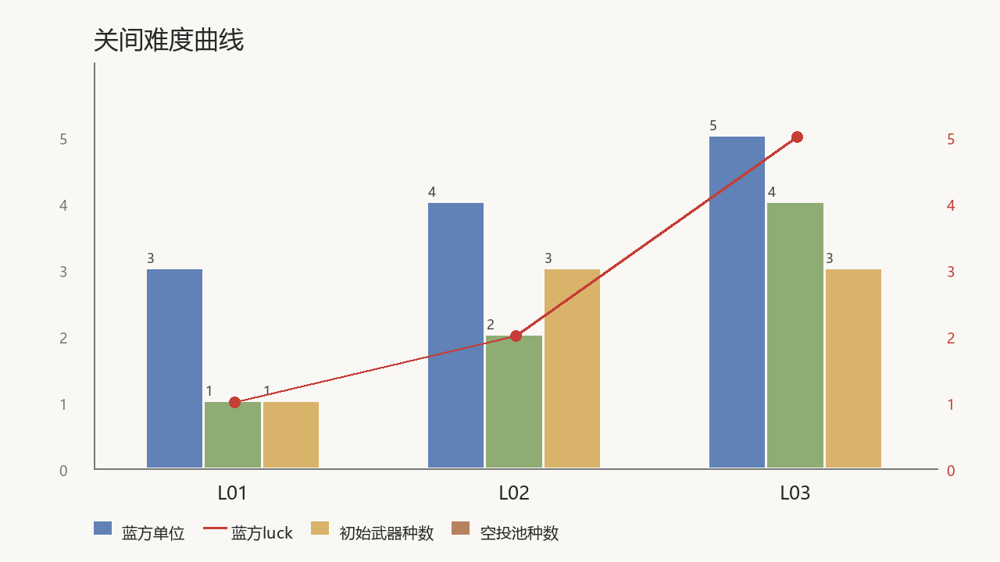

# 关卡设计（目录）

> 战斗关卡的**纸面设计真源**。每关一份设计文档，按 [关卡制作管线](关卡制作管线.md) 的
> 六阶段推进；旧版设计的来龙去脉见 [关卡归档-样板三关DEMO-v0.1.md](关卡归档-样板三关DEMO-v0.1.md)。
> 本文所有设计均为 **AI 提案/待定**——未经用户终审前不得当作已确认设定。

## 文档清单

| 关 | 文档 | 母题 | 体验一句话 | 管线阶段 |
| --- | --- | --- | --- | --- |
| L01 云端漫步 | [L01-云端漫步.md](L01-云端漫步.md) | 单一大平台 + 环台（教学） | 在云上打出第一发，把敌人轰下云 | 3 灰盒落地 |
| L02 碎岛雨 | [L02-碎岛雨.md](L02-碎岛雨.md) | 碎岛雨 | 掷不准就落水，第一次真正怕水 | 3 灰盒落地 |
| L03 天空之岛 | [L03-天空之岛.md](L03-天空之岛.md) | 单一大岛（考核） | 以少打多的终章试炼 | 3 灰盒落地 |

世界海域图（101-108）是另一条内容线（大海域、走 WorldMapComposer），尚未套用本管线，
登记为后续工作。

## 关间难度曲线

设计原则（引用原作实算，见 [关卡设计语言](../关卡设计语言-参照游戏全场景分析.md) §3）：
难度不靠数值碾压，靠「编成规模 × 地形母题 × 武器池 × luck」四要素递进；角色零属性差。
三关定位为教学 → 进阶 → 考核，蓝方 luck 走 1 → 2 → 5（原版四档 1/2/5/10 的前三档）。



```curve 关间难度曲线
level,蓝方单位,蓝方luck,初始武器种数,空投池种数
L01,3,1,1,1
L02,4,2,2,3
L03,5,5,4,3
```

布局图由 `python tools/level-design/render_layouts.py` 从各设计文档的 ASCII 块渲染
（文档是唯一真源）；本曲线图由 `python tools/level-design/render_curve.py` 从上方 curve 块渲染。
